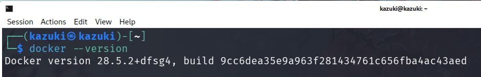
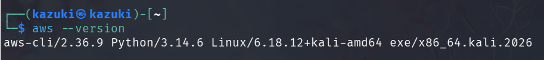
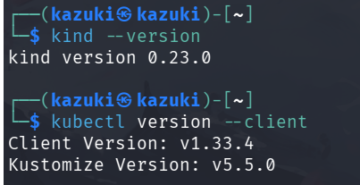
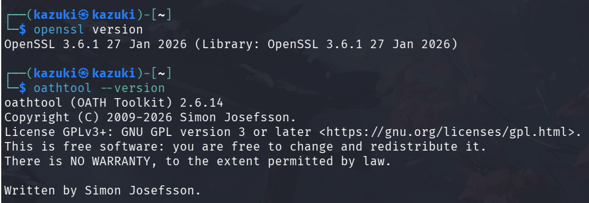
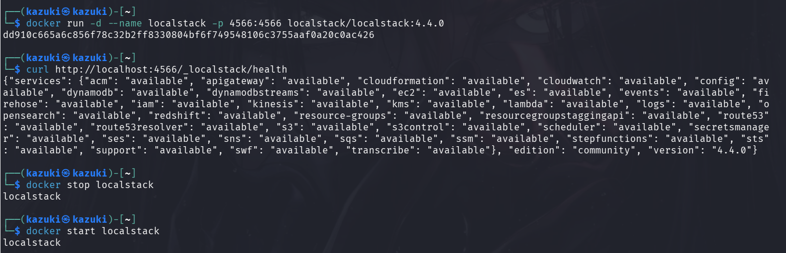
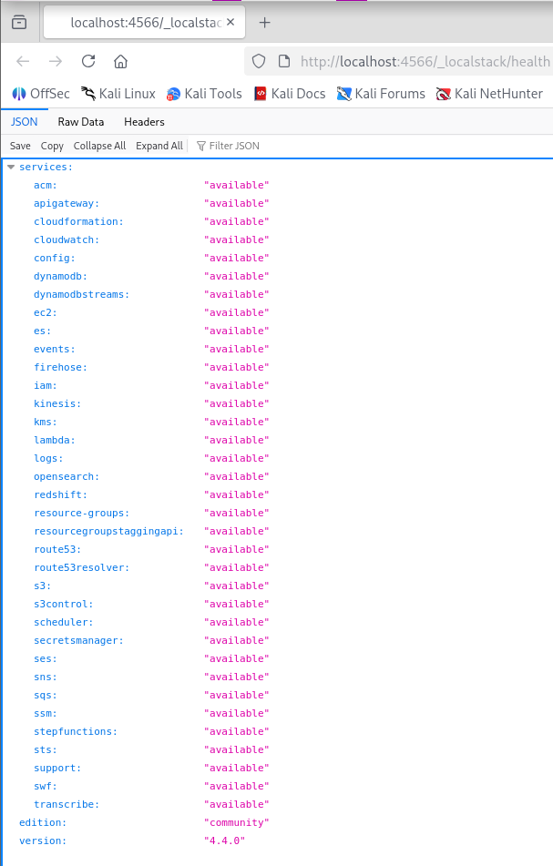
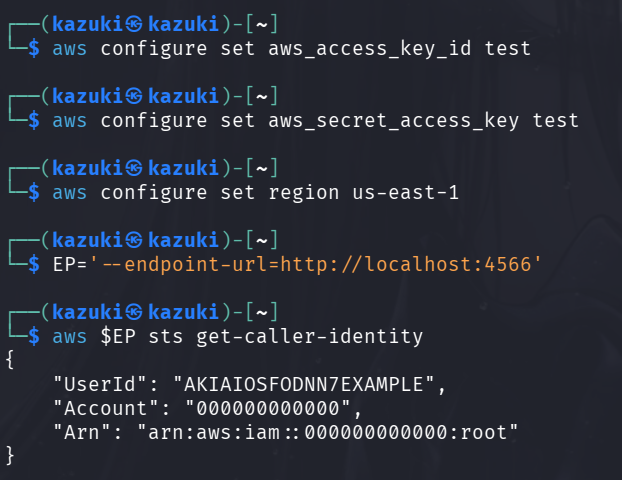
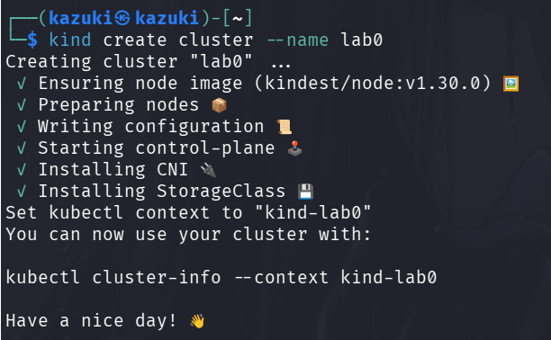
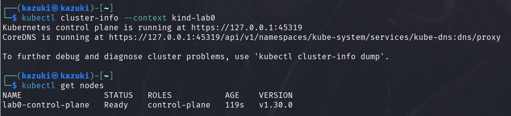
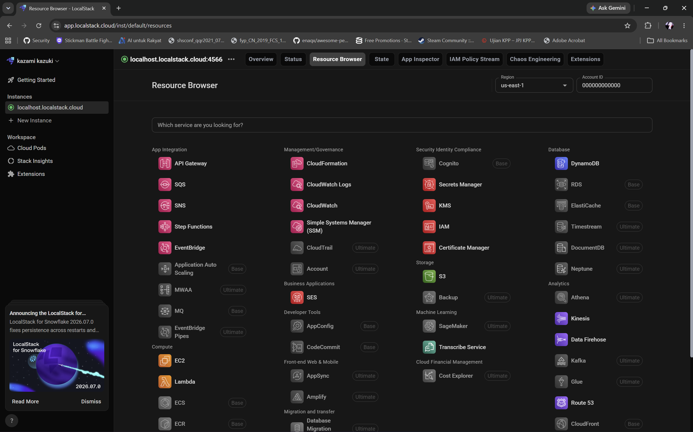

# Lab 0 - Environment Setup

| | |
|---|---|
| **Course** | IKB42603 Cloud Computing Security Essentials |
| **Lab** | Lab 0 - Environment Setup |
| **Name** | MUHAMMAD AKMAL HAKIM BIN MOHD YUZLAN (52215125582) |
| **Date** | 27 July 2026 |

---

## Objective

The objective of Lab 0 is to install and verify all tools required for the course labs. Everything runs locally on your own laptop — no AWS account, no credit card, and no internet access needed after the initial downloads.

---

## Tools to Install

| Tool | Purpose | Used In |
|------|---------|---------|
| **Docker** | Runs containers and the LocalStack cloud simulator | All labs |
| **AWS CLI v2** | Sends AWS commands to LocalStack | Labs 1, 3, 5 |
| **kind** | Runs a local Kubernetes cluster inside Docker | Labs 1, 2, 4 |
| **kubectl** | Controls the Kubernetes cluster | Labs 1, 2, 4 |
| **OpenSSL** | Encryption, keys, and certificates | Lab 3 |
| **oathtool** | Generates MFA / TOTP codes | Lab 4 |
| **Trivy** | Scans containers for vulnerabilities (runs via Docker) | Lab 4 |

---

## Step-by-Step Guide

### Step 1: Install Docker

Docker is the foundation — it runs containers and the LocalStack cloud simulator used in all labs.

**Installation:** Downloaded Docker Desktop from docker.com with the WSL 2 backend. Rebooted after installation.

**Verification:**

```
$ docker --version
Docker version 28.5.2, build 6312585

$ docker run --rm hello-world
Hello from Docker!
This message shows that your installation appears to be working correctly.
```



---

### Step 2: Install AWS CLI v2

The AWS CLI sends commands to LocalStack (our local AWS emulator). No real AWS account is needed — all traffic stays on your laptop.

**Installation:** Downloaded and ran the AWS CLI MSI installer for Windows from the AWS website.

**Verification:**

```
$ aws --version
aws-cli/2.36.9 Python/3.14.6 Windows/10 exe/AMD64
```



---

### Step 3: Install kind & kubectl

kind (Kubernetes-in-Docker) runs a local Kubernetes cluster where each node is a Docker container. kubectl is the command-line tool to manage that cluster. Both are used in Labs 1, 2, and 4.

**Installation (via Chocolatey on Windows):**

```
$ choco install kind
$ choco install kubernetes-cli
```

**Verification:**

```
$ kind --version
kind v0.23.0 go1.22.5 windows/amd64

$ kubectl version --client
Client Version: v1.33.4
Kustomize Version: v5.5.0.20230601165947-4ce0d4c5b0cf
```



---

### Step 4: Helper Tools (OpenSSL, oathtool, Trivy)

These tools are used in later labs for encryption (Lab 3), MFA codes (Lab 4), and vulnerability scanning (Lab 4).

| Tool | Install Method | Used In |
|------|----------------|---------|
| **OpenSSL** | Comes with Git Bash on Windows — no separate install | Lab 3 |
| **oathtool** | Via WSL (Ubuntu) or phone authenticator app | Lab 4 |
| **Trivy** | No install needed — runs via Docker: `docker run --rm aquasec/trivy image <name>` | Lab 4 |

**Verification:**

```
$ openssl version
OpenSSL 3.6.1 27 Jan 2026 (Library: OpenSSL 3.6.1 27 Jan 2026)
```



---

### Step 5: Start & Verify LocalStack

LocalStack emulates AWS services in a Docker container, giving us a fully functional local AWS environment without touching the real cloud.

**Start LocalStack:**

```
$ docker run -d --name localstack -p 4566:4566 localstack/localstack
```

The first run pulls the image (~600 MB); subsequent starts are instant.



**Verify health:**

```
$ curl http://localhost:4566/_localstack/health
{"services": {...}, "version": "4.4.0"}
```



**Management commands:**

| Action | Command |
|--------|---------|
| Stop | `docker stop localstack` |
| Start again | `docker start localstack` |
| Remove completely | `docker rm -f localstack` |

---

### Step 6: One-Time AWS CLI Configuration

LocalStack accepts any credentials. Set dummy values once so the CLI never prompts for them.

```
$ aws configure set aws_access_key_id test
$ aws configure set aws_secret_access_key test
$ aws configure set region us-east-1
```

Create a shortcut variable for the session so you don't have to type `--endpoint-url` every time:

```
$ EP='--endpoint-url=http://localhost:4566'
```

**Prove the CLI talks to LocalStack:**

```
$ aws $EP sts get-caller-identity
{
    "UserId": "test",
    "Account": "000000000000",
    "Arn": "arn:aws:iam::000000000000:user/test"
}
```



> **Optional shortcut:** Install `awslocal` (`pip install awscli-local`) so you can type `awslocal` instead of `aws $EP`.

---

### Step 7: Create & Verify Kubernetes Cluster (kind)

Create a Kubernetes cluster named `ccse` (Cloud Computing Security Essentials) using kind.

**Create cluster:**

```
$ kind create cluster --name ccse
Creating cluster "ccse" ...
 ✓ Ensuring node image (kindest/node:v1.30.0) 🖼
 ✓ Preparing nodes 📦
 ✓ Writing configuration 📜
 ✓ Starting control-plane 🕹️
 ✓ Installing CNI 🔌
 ✓ Installing StorageClass 💾
Set kubectl context to "kind-ccse"
```



**Verify cluster is running:**

```
$ kubectl cluster-info --context kind-ccse
Kubernetes control plane is running at https://127.0.0.1:6443
CoreDNS is running at https://127.0.0.1:6443/api/v1/namespaces/kube-system/services/kube-dns:dns/proxy

$ kubectl get nodes
NAME                   STATUS   ROLES           AGE   VERSION
ccse-control-plane    Ready    control-plane   75s   v1.30.0
```



**Delete the cluster when finished:** `kind delete cluster --name ccse`

---

## Pre-Lab Verification Checklist

- [x] `docker --version` prints a version; `docker run hello-world` works
- [x] `aws --version` prints `aws-cli/2.x`
- [x] `kind --version` and `kubectl version --client` both work
- [x] LocalStack starts and `curl .../health` responds
- [x] `aws $EP sts get-caller-identity` returns an identity
- [x] `kind create cluster` works and `kubectl get nodes` shows a node
- [x] Working inside Git Bash (Windows) — not PowerShell or CMD

---

## Troubleshooting Reference

| Symptom | Fix |
|---------|-----|
| "Cannot connect to the Docker daemon" | Docker Desktop is not running — start it |
| Docker won't start / very slow | Enable virtualization in BIOS; enable WSL 2 + Virtual Machine Platform |
| Port 4566 already in use | `docker rm -f localstack`, then start again |
| aws: "Could not connect to the endpoint URL" | LocalStack is not running, or forgot `--endpoint-url` / `$EP` |
| "aws: command not found" / "kubectl not found" | Tool not on PATH — re-run install; open a new terminal |
| heredoc / sha256sum errors on Windows | You are in PowerShell/CMD — switch to Git Bash or WSL |
| `kind create cluster` fails | Docker not running, or low memory — ensure Docker has ≥ 4 GB |
| Image download is slow in the lab | Pre-pull images before class on Wi-Fi |

---

## Handy One-Liners

**Start everything for a session:**
```bash
docker start localstack 2>/dev/null || docker run -d --name localstack -p 4566:4566 localstack/localstack
EP='--endpoint-url=http://localhost:4566'
```

**Check what is running:**
```bash
docker ps
kind get clusters
```

**Clean up everything (frees disk space):**
```bash
docker rm -f localstack
kind delete clusters --all
docker system prune -f
```

> Containers and clusters can always be recreated from the lab commands. Your report files (screenshots, outputs) are saved on your laptop, not inside containers.

---

## Summary

| Component | Status | Version |
|-----------|--------|---------|
| Docker | ✅ | v28.5.2 |
| AWS CLI v2 | ✅ | v2.36.9 |
| kind | ✅ | v0.23.0 |
| kubectl | ✅ | v1.33.4 |
| OpenSSL | ✅ | v3.6.1 |
| LocalStack | ✅ | v4.4.0 |
| AWS CLI → LocalStack | ✅ | Connected |
| kind cluster (ccse) | ✅ | Kubernetes v1.30.0 |

All components are installed and verified. The environment is ready for Labs 1 through 5.

## Lab0.1


